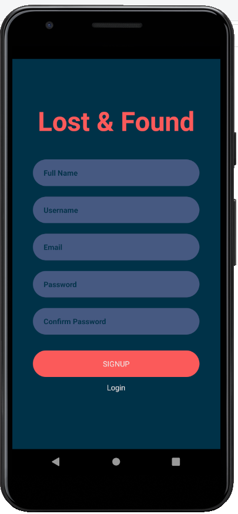
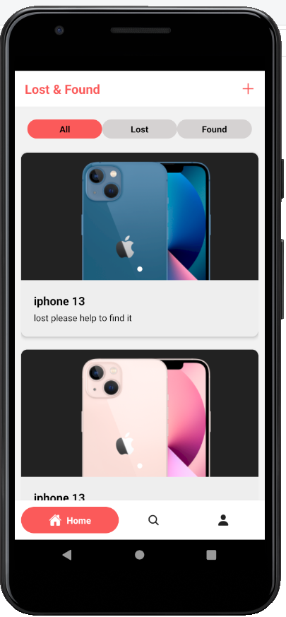

[//]: # (<h1 align="center">)

[//]: # (	)

[//]: # (</h1>)

[//]: # (<h1 align="center" style="color:#fb5b5a">Lost & found</h1>)

[//]: # (
)

[//]: # (

)

[//]: # (

)

 

Check often and claim what is yours.

## Description

The purpose of this application is to put my React Native skills learnt in the Mobile Computing course to use in the development of a mobile app.

In out daily lives, people routinely misplace their belongings such as cell phones, laptops, wallets, clothing, instruments,
and other objects. The purpose of this project is to establish a mobile application called <b>Lost and Found</b> for University of Regina
students and employees, where user can post about their misplaced belongings on campus and anybody can add a note about
something they find on campus. If someone finds something they own on this app, they can claim it by validating the item's 
details and receiving contact information from the person who found it.

## Table of Contents

1. [Configuration instructions](#configuration-instructions)
2. [Installation instructions](#installation-instructions)
3. [Operating instructions](#operating-instructions)
4. [Dependencies](#dependencies)
5. [Manifest](#manifest)
6. [Copyright information](#copyright-information)
7. [Contact information](#contact-information)
8. [Bug list](#bug-list)
9. [Troubleshooting tips](#troubleshooting-tips)
10. [Credits and acknowledgments](#credits-and-acknowledgments)
 

## Configuration instructions

### Prerequisites

Please install the following dependencies before running this project:

- [Node.js](https://nodejs.org) and npm (Recommended: Use [nvm](https://github.com/nvm-sh/nvm))
- [JDK](https://www.oracle.com/java/technologies/javase-jdk11-downloads.html)
- [Android Studio and Android SDK](https://developer.android.com/studio)

Follow [this tutorial](https://www.tutorialspoint.com/react_native/react_native_environment_setup.htm) for React Native - Environment Setup.

## Installation instructions

### Project Set Up

Please, use following `git` command for cloning this application on your system. This will clone this project and 
create a new folder `Lost-and-found` where you cloned this application.

    git clone https://github.com/niravpd8000/Lost-and-found.git

Then, use following command to go into project directory. 

    cd Lost-and-found

### Install dependencies

After that, install all dependencies or devDependencies from a package. json file, use following command.

    npm install

### Run Application

To run an application on a different platform, use the following commands:

    npm start

Run on Android platform:

    npm run android

Run on IOS platform:

    npm run ios

Run on web browser:

    npm run web

### Dependencies

- [axios](https://github.com/axios/axios) for CRUD operations.
- [expo](https://github.com/expo) a framework to develop React Native apps.
- [moment](https://github.com/moment) for date and time.
- [react-native-animated-nav-tab-bar](https://github.com/torgeadelin/react-native-animated-nav-tab-bar) for animated bottom tab bar.
- [react-native-dropdownalert](https://github.com/testshallpass/react-native-dropdownalert#readme) is an alert to notify users.
- [react-native-image-slider](https://github.com/PaulBGD/react-native-image-slider#readme) for image sliding.
- [react-native-skeleton-content](https://github.com/alexZajac/react-native-skeleton-content#readme) for loading animation in a Skeleton-style.

## Operating instructions

 

 

 

 

## Manifest

The following structure includes a list of files:

- `assets`: This folder stores all images and logo.
- `src`: This folder stores all of application's code.
    - `API`: This folder contains all actions that can be dispatched to redux.
      - `apis`: This file contains an object with all api url being called in this app.
      - `axios`: This file contains axios HTTP request methods.
    - `components`: This folder stores all reusable components.
      - `ClaimModal`: A dialog for claiming lost/found item.
      - `ConfirmModal`: A dialog for confirmation from user.
      - `Context`: Contains AuthContext which used for sharing values between components. 
      - `CustomButton`: A custom button component with different style and height. 
      - `ImageUpload`: Image Upload form.
      - `ItemCard`: A reusable item card for displaying lost/found item.
      - `ItemCardSkeleton`: Item Card Skeleton screen.
      - `ItemFullDetails`: A screen for displaying full details of an item.
      - `ReplyModal`: A dialog for replying message.
      - `ShowMoreText`: A component for show and hide full description.
      - `TextField`: A custom reusable text field for getting input from user.
      - `ToastMessage`: Toast error and success message.
    - `constants`: This folder stores all constants used in this application.
      - `colors`: This file contains all colors constants used in application.
    - `navigation`: This folder stores the navigator files.
      - `MainStack`: This file contains Tabs Navigator.
      - `router`: This file contains routing navigation for this application. 
      - `Stacks`: This file stores the stacks navigators.
    - `screens`: Folder that contains all your application screens/features.
        - `ClaimedItem`: This is screen for displaying all items claimed by user.   
        - `Home`: This is main screen of this app.
        - `ItemFullView`: This screen display full view of an item.
        - `ListItemForm`: This is form for report lost/found item.
        - `Login`: This screen contains login form.
        - `MyListing`: This screen is for listing all lost/found item listed by user.
        - `Profile`: This is user profile screen.
        - `ProfileForm`: This is form for updating user profile.
        - `Search`: Screen for searching lost/found items.
        - `SignUp`: This screen contains Signup form for creating an account.
    - `App.js`: The main component of application that allows it to run.

## Copyright information

## Contact information

## Bug list

## Troubleshooting tips

## Credits and acknowledgments